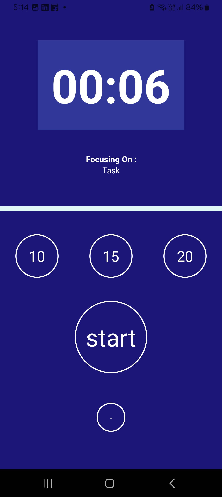
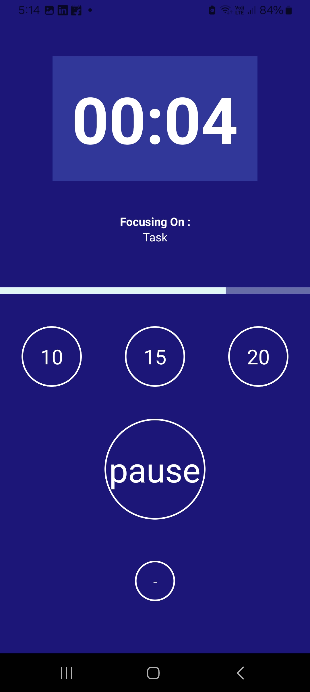
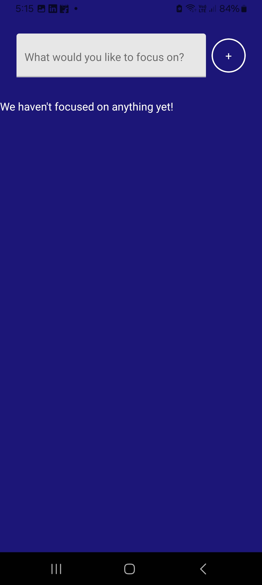

# ⏰ Focus Timer Study Buddy 📚

Welcome to the **Focus Timer Study Buddy** app! This app is designed to help you stay focused and productive during your study sessions by using a timer-based approach. Built with React Native, this is our first app and we are excited to share it with you! 🚀

## Features ✨

- **Pomodoro Timer**: Use the Pomodoro technique to break your study time into intervals with breaks in between.
- **Customizable Sessions**: Adjust the length of focus sessions and breaks to suit your study style.
- **Progress Tracking**: Keep track of your completed sessions and stay motivated.
- **Notifications**: Get notified when it's time to take a break or get back to work.
- **Simple and Intuitive UI**: Easy to use interface designed for maximum productivity.

## Screenshots 📸

| Focus Timer Screen | Break Timer Screen | Progress Screen |
| ------------------ | ------------------ | --------------- |
|  |  |  |

## Getting Started 🚀

Follow these instructions to get a copy of the project up and running on your local machine for development and testing purposes.

### Prerequisites 🛠️

Make sure you have the following installed on your development machine:

- [Node.js](https://nodejs.org/) (LTS version recommended)
- [Yarn](https://yarnpkg.com/) or [npm](https://www.npmjs.com/)
- [React Native CLI](https://reactnative.dev/docs/environment-setup)

### Installation 📦

1. **Clone the repository:**

   ```bash
   git clone https://github.com/yourusername/focus-timer-study-buddy.git
   cd focus-timer-study-buddy
   ```

2. **Install dependencies:**

   ```bash
   yarn install
   # or
   npm install
   ```

3. **Run the app:**

   For iOS:
   ```bash
   npx react-native run-ios
   ```

   For Android:
   ```bash
   npx react-native run-android
   ```

## Usage 🎮

1. **Start a session**: Tap the start button to begin your focus session.
2. **Break time**: Receive a notification when it's time to take a break.
3. **Track your progress**: View the number of sessions completed and stay motivated.

### Download the APK 📥

If you prefer, you can directly download the APK file and install the app on your Android device:
-> Download the .apk file

## Contributing 🤝

Contributions are what make the open source community such an amazing place to be, learn, inspire, and create. Any contributions you make are **greatly appreciated**.

1. Fork the Project
2. Create your Feature Branch (`git checkout -b feature/AmazingFeature`)
3. Commit your Changes (`git commit -m 'Add some AmazingFeature'`)
4. Push to the Branch (`git push origin feature/AmazingFeature`)
5. Open a Pull Request

## License 📄

This project is licensed under the MIT License - see the [LICENSE](LICENSE) file for details.

## Acknowledgements 🙏

- Inspired by the [Pomodoro Technique](https://en.wikipedia.org/wiki/Pomodoro_Technique)
- Thanks to the [React Native community](https://reactnative.dev/) for their amazing resources and support.

---

Made with ❤️ by [Abhik](https://github.com/Abhik4004)

---
